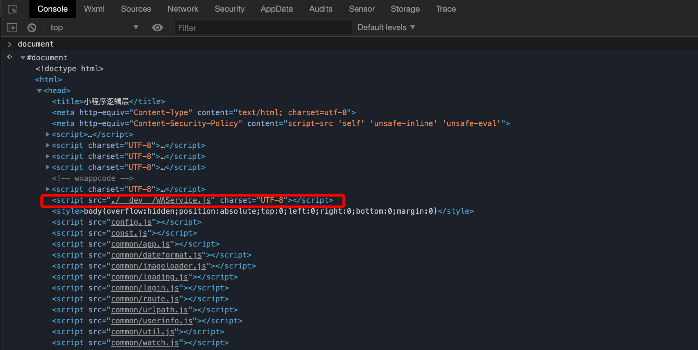
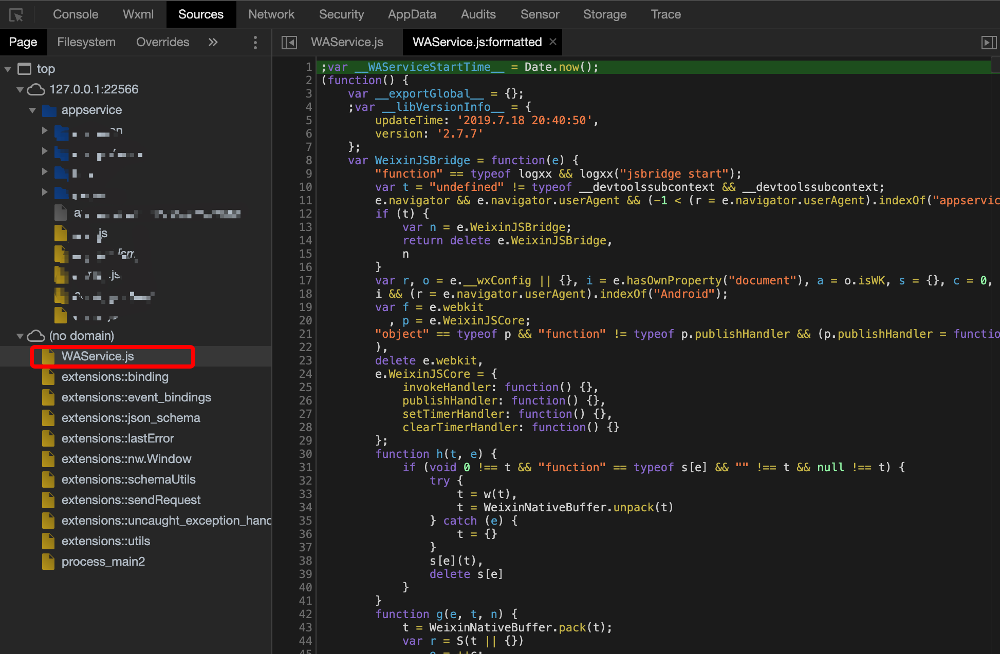
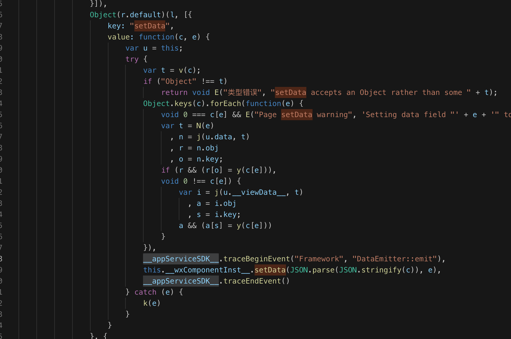

## 小程序逻辑层框架源码
- 微信小程序运行在三端：iOS（iPhone/iPad）、Android 和 用于调试的开发者工具。在开发工具上，小程序逻辑层的 javascript 代码是运行在 NW.js 中，视图层是由 Chromium 60 Webview 来渲染的。这里简单点就直接通过开发者工具来查找源码。
- 在微信开发者工具中，编译运行你的小程序项目，然后打开控制台，输入 document 并回车，就可以看到小程序运行时，WebView 加载的完整的 WAPageFrame.html，如下图：

可以看到`./__dev__/WAService.js`这个库就小程序逻辑层基础库，提供逻辑层基础的 API 能力

## 查找WAService.js源码
- 在微信小程序 IDE 控制台输入 openVendor 命令，可以打开微信小程序开发工具的资源目录

我们可以看到小程序各版本的运行时包 .wxvpkg。.wxvpkg 文件可以使用 [wechat-app-unpack](https://github.com/leo9960/wechat-app-unpack) 解开，解开后里面就是 WAService.js 和 WAWebView.js 等代码。


- 另外也可以只直接通过开发者工具的Sources面板查找到WAWebView.js的源码


## 分析setData源码
- 在WAWebView.js中全局查找setData方法，找到定义此方法的地方，如下


- setData函数定义中添加了关键的注释如下：
```js
function(c, e) {
    // 保存闭包内的this对象，即常用的that
    var u = this;
    // 官网定义 Page.prototype.setData(Object data, Function    callback),
    // 即 c: Object对象，e: Function界面更新渲染完毕后的回调函数
    try {
        // 返回 [object Object] 中的Object
        var t = v(c);
        if ("Object" !== t)
            return void E("类型错误", "setData accepts an Object rather than some " + t);
        Object.keys(c).forEach(function(e) {
            // e: 可枚举属性的键值, void 0 表示undefined (https://github.com/lessfish/underscore-analysis/issues/1)
            void 0 === c[e] && E("Page setData warning", 'Setting data field "' + e + '" to undefined is invalid.');
            // t为包含子对象属性名的属性数组, u.data和u.__viewData__都是page.data的深拷贝副本
            var t = N(e)
              , n = j(u.data, t)
              , r = n.obj
              , o = n.key;
            if (r && (r[o] = y(c[e])),
            void 0 !== c[e]) {
                var i = j(u.__viewData__, t)
                  , a = i.obj
                  , s = i.key;
                a && (a[s] = y(c[e]))
            }
        }),
        __appServiceSDK__.traceBeginEvent("Framework", "DataEmitter::emit"),
        this.__wxComponentInst__.setData(JSON.parse(JSON.stringify(c)), e),
        __appServiceSDK__.traceEndEvent()
    } catch (e) {
        k(e)
    }
}
```
- 关键函数N(e)，解析属性名(包含.和[]等数据路径符号)，返回相应的层级数组，关键的注释如下
```js
function N(e) {
    // 如果属性名不是String字符串就抛出异常
    if ("String" !== v(e))
        throw E("数据路径错误", "Path must be a string"),
        new M("Path must be a string");
    for (var t = e.length, n = [], r = "", o = 0, i = !1, a = !1, s = 0; s < t; s++) {
        var c = e[s];
        if ("\\" === c)
            // 如果属性名中包含\\. \\[  \\] 三个转义属性字符就将. [ ]三个字符单独拼接到字符串r中保存，否则就拼接\\
            s + 1 < t && ("." === e[s + 1] || "[" === e[s + 1] || "]" === e[s + 1]) ? (r += e[s + 1],
            s++) : r += "\\";
        else if ("." === c)
            // 遇到.字符并且r字符串非空时，就将r保存到n数组中并清空r; 目的是将{ a.b.c.d: 1 }中的链式属性名分开,保存到数组n中，如[a,b,c,]
            r && (n.push(r),
            r = "");
        else if ("[" === c) {
            // 遇到[字符并且r字符串非空时，就将r保存到n数组中并清空r；目的是将{ array[11]: 1 }中的数组属性名保存到数组n中，如[array,]
            // 如果此时[为属性名的第一个字符就报错,也就是说属性名不能直接为访问器, 如{ [11]: 1}
            if (r && (n.push(r),
            r = ""),
            0 === n.length)
                throw E("数据路径错误", "Path can not start with []: " + e),
                new M("Path can not start with []: " + e);
            // a赋值为true, i赋值为false
            i = !(a = !0)
        } else if ("]" === c) {
            if (!i)
                throw E("数据路径错误", "Must have number in []: " + e),
                new M("Must have number in []: " + e);
            // 遍历到{ array[11]: 1 }中的']'的时候，就将a赋值为false, 并将o保存到数组n中，如[array,11,]
            a = !1,
            n.push(o),
            o = 0
        } else if (a) {
            if (c < "0" || "9" < c)
                throw E("数据路径错误", "Only number 0-9 could inside []: " + e),
                new M("Only number 0-9 could inside []: " + e);
            // 遍历到{ array[11]: 1 }中的'11'的时候，就将i赋值为true, 并将string类型的数字计算成Number类型保存到o中
            i = !0,
            o = 10 * o + c.charCodeAt(0) - 48
        } else
            r += c  // 普通类型的字符就直接拼接到r中
    }
    // 将普通的字符串属性名，.和]后面剩余的字符串保存到数组n中,如{abc: 1} => [abc], {a.b.c: 1} => [a,b,c], {array[0].text: 1} => [array, 0, text]
    if (r && n.push(r),
    0 === n.length)
        throw E("数据路径错误", "Path can not be empty"),
        new M("Path can not be empty");
    return n
}
```
- 关键函数j(e, t)，解析出属性最终对应的子对象的属性名，以及对应的子对象
```js
var x = Object.prototype.toString;
function _(e) {
    return "[object Object]" === x.call(e)
}
function j(e, t) {
    // e: page.data的深拷贝副本, t为包含子对象属性名的属性数组
    /*
        - 遍历属性数组[a,b], e={a: {b: 1}}
        1. i=0, 此时o为Object类型时, n = a, r = {a: {b: 1}}, o = {b: 1};
        2. i=1, 此时o为Object类型时, n = b, r = {b: 1}, o = 1;
        retrun { obj: {b: 1}, key: b}

        - 遍历属性数组[a,0,b], e={a: [{b: 1}]}
        1. i=0, 此时t[i]=a, o为Object类型时, n = a, r = {a: [{b: 1}]}, o = [{b: 1}];
        2. i=1, 此时t[i]=0, o为Array类型时, n = 0, r = [{b: 1}], o = {b: 1};
        3. i=2, 此时t[i]=b, o为Object类型时, n = b, r = {b: 1}, o = 1;
        retrun { obj: {b: 1}, key: b}
    */
    for (var n, r = {}, o = e, i = 0; i < t.length; i++)
        Number(t[i]) === t[i] && t[i] % 1 == 0 ? // t[i]是否为有效的Number
        Array.isArray(o) || (r[n] = [], o = r[n]) :
        _(o) || (r[n] = {}, o = r[n]), 
        n = t[i], o = (r = o)[t[i]]; //注意由于逗号分隔符的优先级是最低的，所以这一行会在前面的条件运算符执行完，再执行
    return {
        obj: r,
        key: n
    }
}
```
- 最后通过`r && (r[o] = y(c[e]))`的方式将新的值赋给匹配出的子对象的属性，这里j(e,t)函数内部是通过应用的方式向外传递出`r`，所以这里改变`r[o]`的值也会将`c`内部的值相应修改